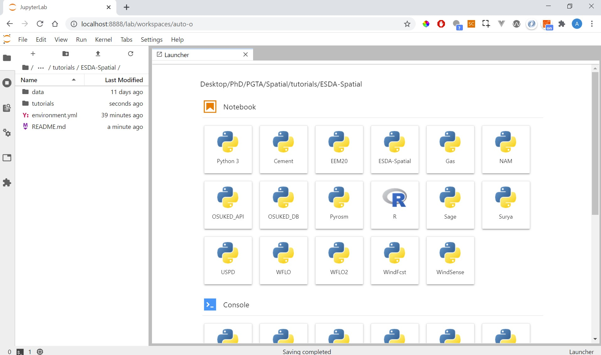

# UCL Energy Systems & Data Analytics - Spatial Module
 
This repository contains set-up instructions, code, and general resources for the spatial module included in the UCL ESDA masters course. These materials have been rewritten and reformatted in order to make them as accessible as possible for remote teaching during the Coronavirus lockdown. We have endeavoured to ensure the set-up is as easy as possible but for anyone who has problems please post in the Moodle forum or alternatively in the Github Issues for this repository.

<br>
<br>

### Set-Up Instructions

First we must install Anaconda, a platform for managing data science environments and tools, it can be downloaded using the links at the bottom of [this page](https://www.anaconda.com/download/) (use the 64-bit versions).

We now need to create the environment in which we can do our spatial analysis. In programming an environment refers to the suite of software and tooling used, in this case the specific R packages required for us to carry out spatial analyses. Anaconda makes this easy for us to set-up as all of the information on how to create an environment is stored in the *environment.yml* file, which is located in the top directory of this repository. We'll now walk through the commands that need to be run.

<br>

<b>Windows</b>

Firstly we need to open the command line, then we must move to the directory that contains all of the files. ```cd``` means change directory, which we must follow with the specific path to where you downloaded this directory.

```bash
cd path/to/this/directory
```

Next we'll create the ESDA-Spatial programming environment using 

```bash
conda env create -f environment.yml
```

The *.yml* file will look similar to the code below. It outlines the name of the environment, where it should download packages from, and which packages it should retrieve.

```yaml
name: ESDA-Spatial
channels:
    - r
    - conda-forge
dependencies:
    - name-of-package-1
    - name-of-package-2
    ...
```

Next we'll *activate* the environment 

```bash
conda activate ESDA-Spatial
```

When you run this command you should see that the command line prefix has changed from *base* to *ESDA-spatial*, this means that everything has worked and any further commands you type will be run using the environment you've just made.

e.g.

```console
(base) C:\Users\Ayrton>conda activate ESDA-spatial
(ESDA-spatial) C:\Users\Ayrton>
```

We now need to add the environment to the IPython kernel

```bash
ipython kernel install --user --name=ESDA-Spatial
```

Finally we can get Jupyter Lab running by using:

```bash
jupyter lab
```

A Jupyter Lab session should now open up automatically in your default browser, if not you can copy the address that it will print into the command line and paste that into a browser - e.g. ```http://localhost:8888/?token=6e63afag498b84292580b0332591c5775c824cc911913652```. 

The browser should look similar to the display shown below.

<center></img></center>

<br>

<b>Mac</b>

Coming soon